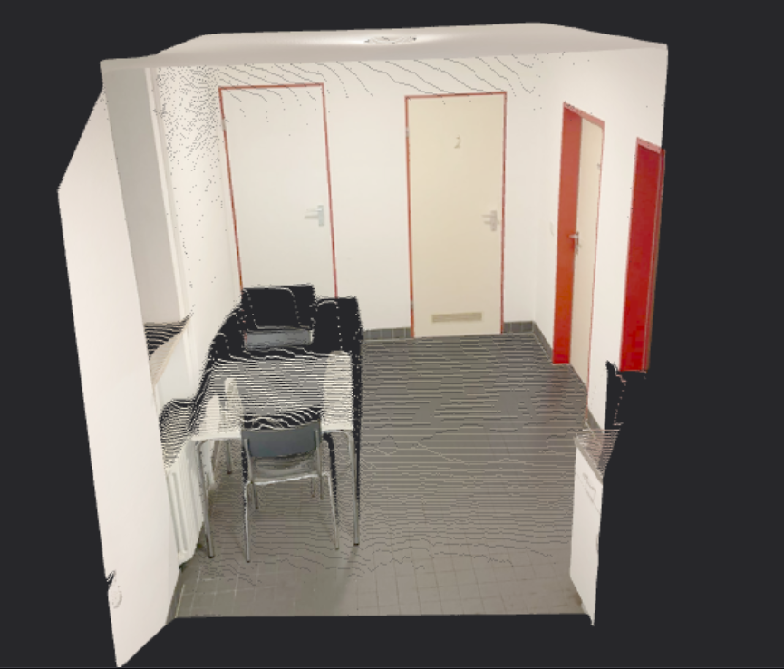
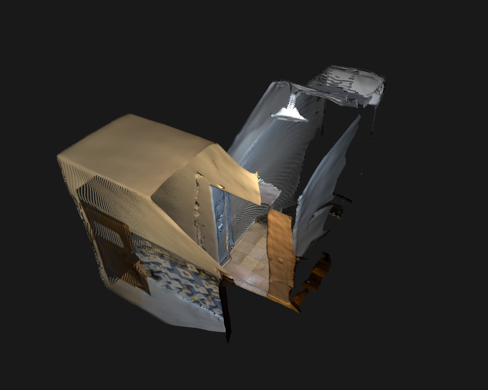
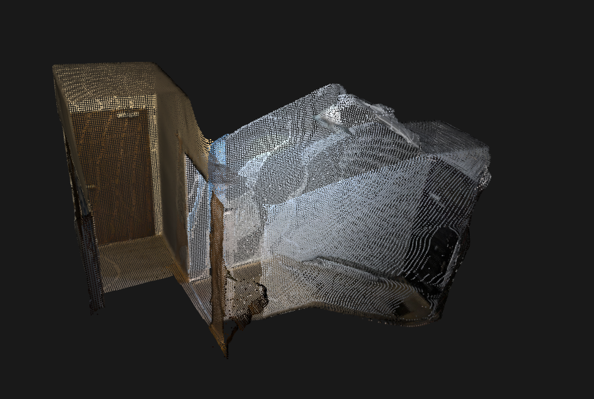
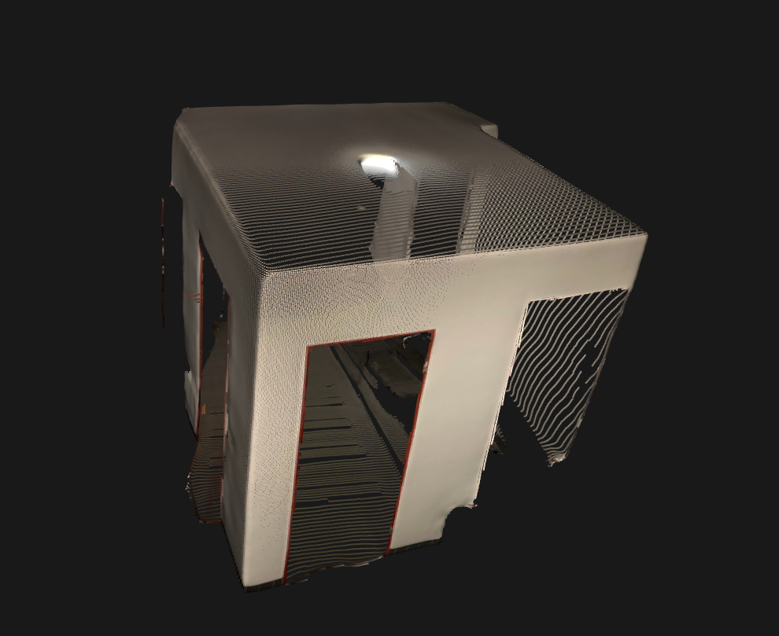
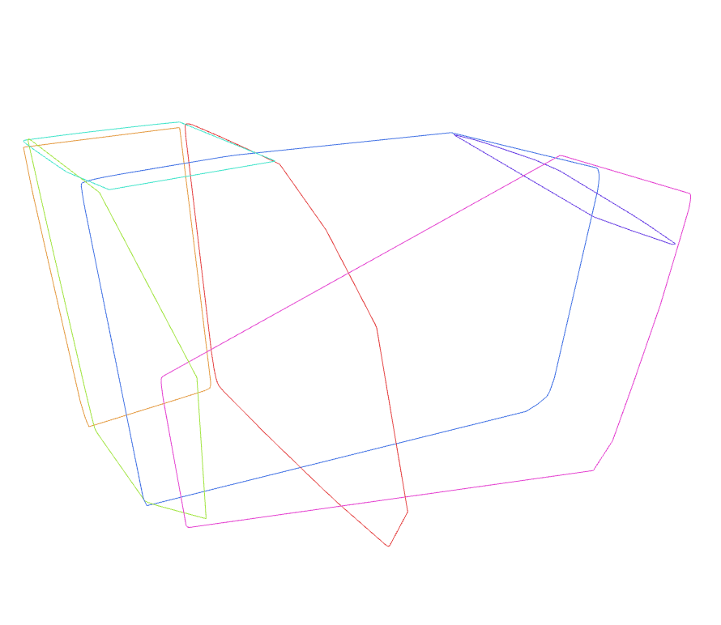
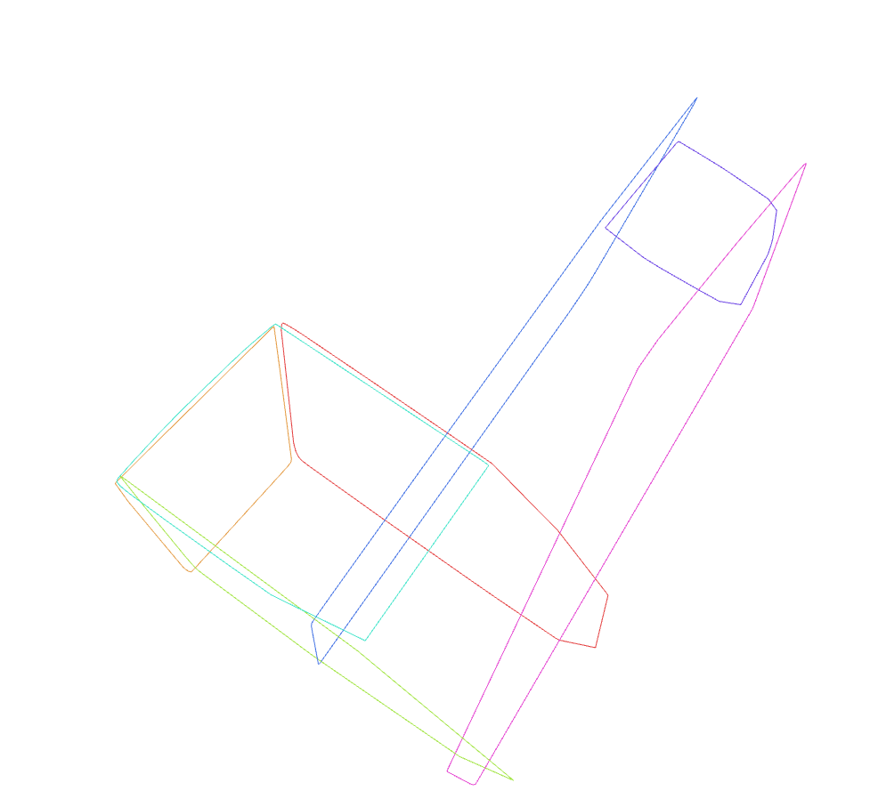

# Point Cloud to BIM Planes
**Automated Structural Element Extraction**

---

## 1. Problem & Solution

### The Challenge
Traditional BIM creation requires **manual measurement** and modeling
- Time-consuming (days of work)
- Requires expensive LiDAR equipment
- Point clouds include noise and unwanted objects

### Our Solution
**Automated Pipeline: Images → 3D Point Cloud → Structural Planes**




**Key Innovation**: AI-powered object removal + geometric plane extraction

---

## 2. Pipeline Architecture

### Four-Step Process

```
┌─────────────┐    ┌───────────────┐    ┌───────────────┐    ┌─────────────┐
│   Images    │ -> │ Remove Objects│ -> │  Point Cloud  │ -> │   Planes    │
│             │    │  (YOLO + SAM) │    │(modified VGGT)│    │  (RANSAC)   │
└─────────────┘    └───────────────┘    └───────────────┘    └─────────────┘
```

### Technologies Used
| Step | Technology | Purpose |
|------|-----------|---------|
| 1 | YOLOv8 + SAM | Remove furniture, people |
| 2 | VGGT (Meta) | 3D reconstruction |
| 3 | RANSAC + Convex Hull | Extract wall/floor planes |
| 4 | Open3D | Visualization & validation |

**Processing Time**: ~5-15 minutes per scene

---

## 3. Results: Point Cloud Quality

### Dense 3D Reconstruction


### Multi-View Fusion


**Output Statistics**:
- 50,000 - 500,000 points per scene
- Sub-centimeter accuracy
- Confidence-based filtering (removes noise)
- Automatic coordinate correction

---

## 4. Results: Plane Extraction

### Wireframe Boundaries



### Key Features
✓ **Bounded polygons** - Convex hull (not infinite planes)  
✓ **Tight fitting** - Follows actual geometry  
✓ **Auto-classification** - Walls vs. floors vs. ceilings  
✓ **Interactive selection** - User validates final output  

### Plane Data Output
- Dimensions (width × height)
- Normal vectors
- Center coordinates
- Boundary vertices (for CAD/BIM import)

---

## 5. Impact & Applications

### Technical Advantages
| Traditional Methods | Our Approach |
|-------------------|--------------|
| Days of manual work | **Minutes of processing** |
| Expensive LiDAR | **Phone camera photos** |
| Manual measurements | **Automated extraction** |
| 2D plans only | **Full 3D geometry** |

### Applications
🏗️ **Architecture**: As-built documentation, renovation planning  
🏢 **Real Estate**: Accurate floor plans, virtual tours  
🔧 **Facility Management**: Space analysis, maintenance  
🏛️ **Heritage**: Archaeological documentation, preservation  

### Next Steps
- Door/window detection in walls
- 2D floor plan generation
- Direct IFC export for BIM software

---

**Thank You!**

**Project**: Point Cloud to BIM Pipeline  
**Code**: h:/nov_proj/c2b2/  
**Documentation**: README_PIPELINE.md  
